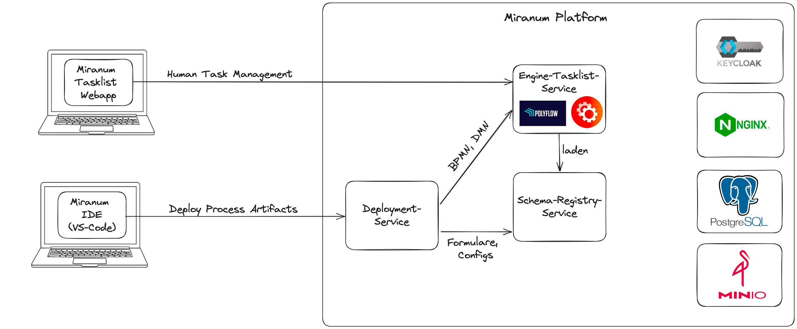

# Miranum Plattform

Many components and code of this repository are based on the [DigiWF project](https://github.com/it-at-m/digiwf-core) .

The following tools are interchangeable, but work best in the current version:
- DB: PostgreSQL
- SSO: Keycloak
- File Storage: Minio
- Reverse-Proxy: Nginx 
