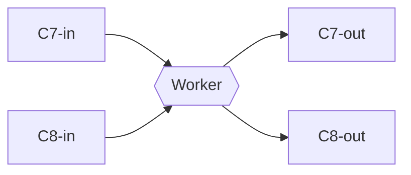
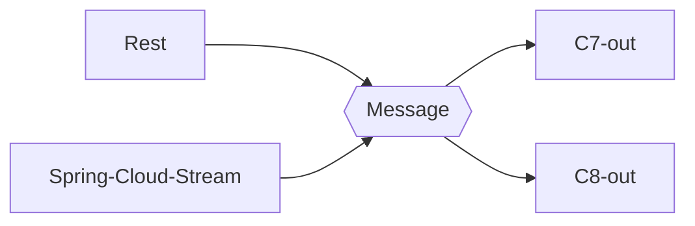
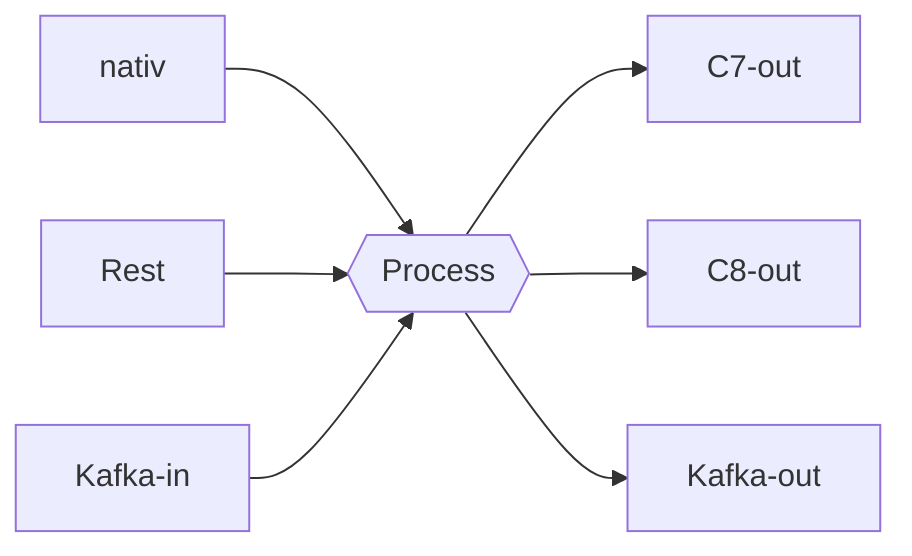
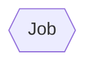

<!-- PROJECT SHIELDS -->

<!-- END OF PROJECT SHIELDS -->

<!-- PROJECT LOGO -->
 

  

<h3 align="center">Miranum</h3>

  

    <i>One connector to rule them all</i>
     <a href="https://github.com/flowsquad/miranum/issues">Report Bug</a>
    ·
    <a href="https://github.com/flowsquad/miranum/issues">Request Feature</a>
  

<!-- ABOUT THE PROJECT -->

## About The Project

(<a href="#top">back to top</a>)

### Built With

The project is built with technologies:

* Spring Boot

(<a href="#top">back to top</a>)

<!-- ROADMAP -->

## Roadmap

*if you have a ROADMAP for your project add this here*

See the [open issues](#) for a full list of proposed features (and known issues).

(<a href="#top">back to top</a>)

## Getting started

*how can I start and fly this project*

(<a href="#top">back to top</a>)

<!-- CONTRIBUTING -->

## Contributing

Contributions are what make the open source community such an amazing place to learn, inspire, and create. Any
contributions you make are **greatly appreciated**.

If you have a suggestion that would make this better, please open an issue with the tag "enhancement", fork the repo and
create a pull request. You can also simply open an issue with the tag "enhancement". Don't forget to give the project a
star! Thanks again!

1. Open an issue with the tag "enhancement"
2. Fork the Project
3. Create your Feature Branch (`git checkout -b feature/AmazingFeature`)
4. Commit your Changes (`git commit -m 'Add some AmazingFeature'`)
5. Push to the Branch (`git push origin feature/AmazingFeature`)
6. Open a Pull Request

More about this in the [CODE_OF_CONDUCT](/CODE_OF_CONDUCT.md) file.

(<a href="#top">back to top</a>)

<!-- LICENSE -->

## License

Distributed under the MIT License. See `LICENSE` file for more information.

(<a href="#top">back to top</a>)

