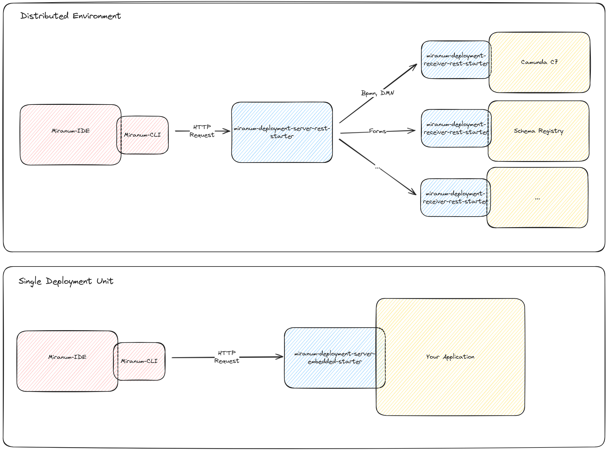

# Miranum Deployment

Checkout our docs at [miranum.io](https://www.miranum.io/docs/components/miranum-ide/miranum-deployment) for more information.

Miranum Deployment consists of two parts. The Miranum Deployment Server and the Miranum Deployment Receiver.
The Miranum Deployment Server is a Spring Boot application that provides a REST API to deploy process artifacts to
Spring applications that use the Miranum Deployment Receiver library.



## Module Structure

- **core**: Contains the core implementation for Miranum-Deployment.
- **rest**: Contains the REST adapter implementation for Miranum-Deployment.
- **embedded**: Contains the embedded adapter implementation for Miranum-Deployment.
- **examples**: Contains example implementations using different adapters of Miranum-Deployment-Server and Miranum-Deployment-Receiver.

## Usage

We provide Spring Boot starters for the Miranum Deployment Server and the Miranum Deployment Receiver.
You can add these starters to your Spring Boot application and customize the deployment for your use case.

### Miranum Deployment Server

The Miranum Deployment Server is a single API for the *Miranum-IDE* to deploy process artifacts to.
It transfers the process artifacts to applications which implement the Miranum Deployment Receiver library.

#### Miranum Deployment Server REST

> A full example is available in the [miranum-deployment-rest-example](examples/rest-example) module.

1. Add the Miranum Deployment Server REST starter to your spring application.

```xml
<dependency>
    <groupId>io.miranum.platform</groupId>
    <artifactId>miranum-deployment-server-rest-starter</artifactId>
    <version>${project.version}</version>
</dependency>
```

2. Configure the Miranum Deployment Server REST targets.

```yaml
io:
    miranum:
        deploymentserver:
            rest:
                enabled: true
                targets:
                    # Deploy all files to a single deployment receiver
                    dev:
                        bpmn: 'http://localhost:9001/rest/deployment'
                        dmn: 'http://localhost:9001/rest/deployment'
                        form: 'http://localhost:9001/rest/deployment'
                        config: 'http://localhost:9001/rest/deployment'
                    # Deploy files to multiple deployment receivers
                    test:
                        bpmn: 'http://localhost:9002/rest/deployment'
                        dmn: 'http://localhost:9003/rest/deployment'
                        form: 'http://localhost:9004/rest/deployment'
                        config: 'http://localhost:9005/rest/deployment'
```

##### Custom Feign Request Interceptor

You can add a custom Feign Request Interceptor to the Miranum Deployment Server REST starter.
Therefore, create a custom bean of type `DeployFilePort` and provide the `RequestInterceptor` as a constructor parameter to `MiranumRestDeployment` like in the example below.

```java
private final RequestInterceptor requestInterceptor;
private final DeploymentServerRestProperties deploymentServerRestProperties;

@Bean
public DeployFilePort deployFilePort() {
    return new MiranumRestDeployment(this.deploymentServerRestProperties.getTargets(), List.of(requestInterceptor));
}
```


#### Miranum Deployment Server Embedded

In case you have a single spring application you can use the Miranum Deployment Server Embedded starter.
It provides the Miranum Deployment Server as well as a build in Miranum Deployment Receiver implementation.

> A full example is available in the [miranum-deployment-embedded-example](examples/embedded-example) module.

##### Usage

1. Add the Miranum Deployment Server Embedded starter to your spring application.

```xml
<dependency>
    <groupId>io.miranum.platform</groupId>
    <artifactId>miranum-deployment-server-embedded-starter</artifactId>
    <version>${project.version}</version>
</dependency>
```

2. Implement the `MiranumDeploymentReceiver` interface and provide it as spring bean.

```java
import io.miragon.miranum.deploymentreceiver.application.ports.out.MiranumDeploymentReceiver;
import org.springframework.stereotype.Component;

import java.util.List;

@Component
public class ExampleDeploymentReceiver implements MiranumDeploymentReceiver {

    @Override
    public void deploy(final Deployment deployment, final List<String> tags) {
        // TODO: Implement your deployment logic here
    }

}
```

### Miranum Deployment Receiver

Add the Miranum Deployment Receiver REST starter to each Spring application that should deploy process artifacts.
In the Miranum Deployment Server you can configure the target applications via the application.yml file.

> A full example is available in the [miranum-deployment-embedded-example](examples/embedded-example) module.
> Note: The miranum-deployment-embedded is both an embedded deployment server and a deployment receiver.

#### Usage

1. Add the Miranum Deployment Receiver REST starter to your Spring application.

```xml
<dependency>
    <groupId>io.miranum.platform</groupId>
    <artifactId>miranum-deployment-receiver-rest-starter</artifactId>
    <version>${project.version}</version>
</dependency>
```

2. Implement the `MiranumDeploymentReceiver` interface and provide it as spring bean.

```java
import io.miragon.miranum.deploymentreceiver.application.ports.out.MiranumDeploymentReceiver;
import org.springframework.stereotype.Component;

import java.util.List;

@Component
public class ExampleDeploymentReceiver implements MiranumDeploymentReceiver {

    @Override
    public void deploy(final Deployment deployment, final List<String> tags) {
        // TODO: Implement your deployment logic here
    }

}
```

