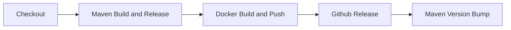

# CICD

We use GitHub Actions for CICD Pipelines. The pipelines are defined in the `.github/workflows` directory.

## Workflows

### Build

**Feature Branches**

Build the project using Maven on each commit and PR to the `main` branch.

**Main Branch**

Every new commit to the `main` branch builds the project using Maven and builds and releases Docker Images to Docker Hub with the tag `dev`.

### Release

Releases are triggered by dispatching the Release workflow manually.
The release workflow creates a new maven release and builds and releases Docker Images to Docker Hub with a version tag.
Additionally, a GitHub Release is created with auto generated release notes and finally the Maven version is bumped to the next snapshot version (or the version specified with the workflow dispatch).

