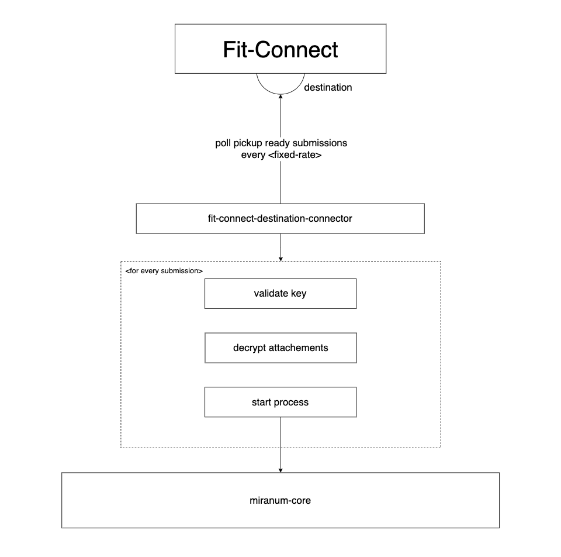

# Fit-Connect example

*This example shows how you can use miranum and its fit-connect connector to start processes based on polled submissions for any fit-connect destination.*

## Make it run

To start the project you can refer to the [fit-connect-example-c8](fit-connect-example-c8/README.md). \
The `fit-connect-example-c8` polls pickup ready submissions form a fit-connect destination and starts a Camunda 8 process.

## How it works

The provided example uses the `fit-connect-destination-connector` to schedule the polling task. The task includes fetching 
pickup ready submissions form a defined fit-connect destination in a given fixed rate *(default: 60s)*. The exposed service 
decrypts all attachments for every pickup ready submission and starts a defined process with the attachments as input variables
to the process. Currently, it then accepts all submissions by sending an `submission-accept` case event.

The diagram visualizes the functionality roughly. To have a better understanding of the encryption and decryption that has to be made
please refer to the [fit-connect documentation](https://docs.fitko.de/fit-connect/docs/).

