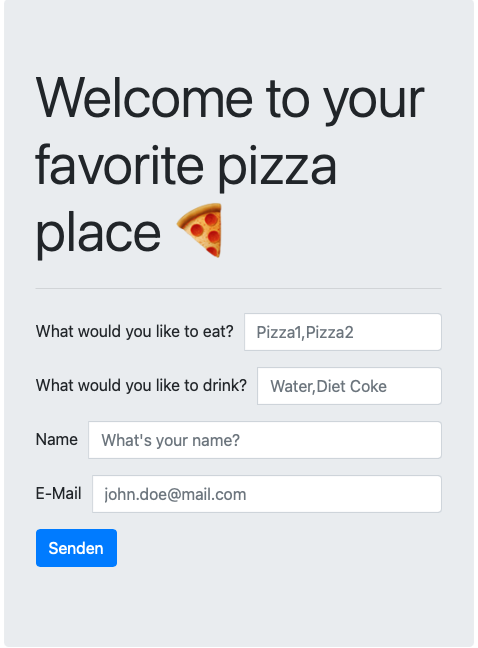
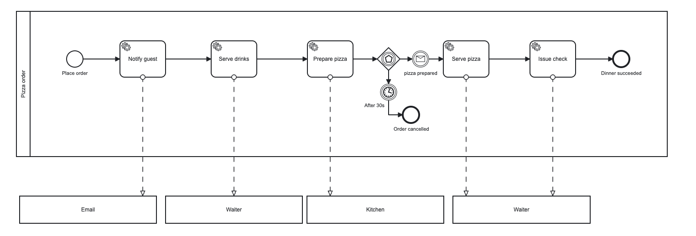
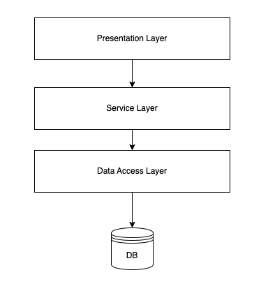
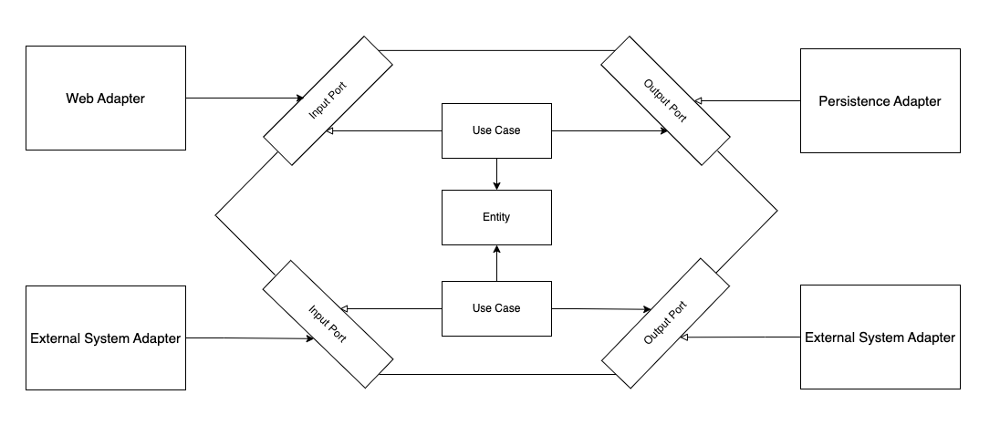
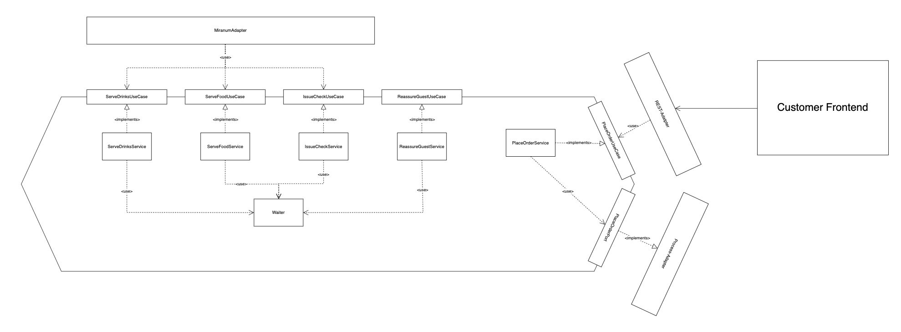
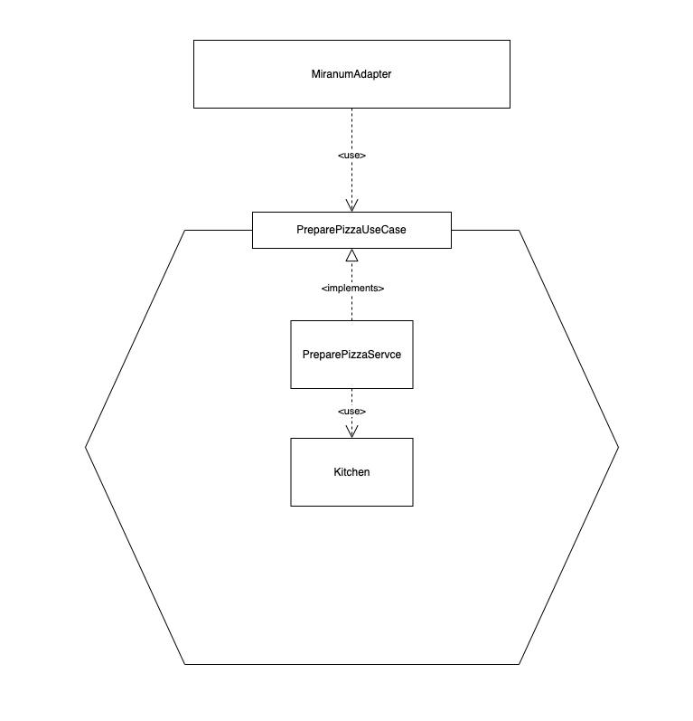
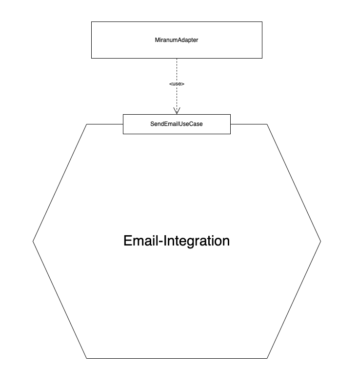

# Pizza order example

*This example demonstrates how to use miranum connect and how you can decouple microservices using it.*

There are four services in total:

* `waiter`: responsible for placing the order, serving beverages and issuing the check
* `kitchen`: responsible for the cooking
* `notification`: responsible for notifying the customer for the order confirmation
* `frontend`: frontend to place order to the waiter service by REST

## Run the project

1. Start all services, either the Camunda 7 or Camunda 8 ones (e.g. `WaiterC8Application`, `KitchenC8Application`, `NotificationC8Application`) and the `PizzaOrderFrontEnd`
2. Make sure that you have a running instance of the Camunda Platform 8 engine running. <br> *If not, just start the [camunda-8 stack](../../stack/camunda-8/docker-compose.yml).*
3. Now navigate to http://localhost:5050 to view the Frontend-Application. You will end up seeing something like this:

<br>
<div align="center">
    
</div>
<br>

Now you can start a new order by filling out the form. Provide food (one or a comma separated list), drinks
your name and your email address. The email is not actually sent. For the sake of this example it is just a print on the console of the notification service.

*Hint: When using IntelliJ you can start all four services by adding a compound run configuration.*

After submitting your order, you should notice the success message below.

<br>
<div align="center">
    
</div>
<br>

You now can follow the logs in the different service consoles to get a better overview on what is happening in the different services.

## The process



The order pizza example demonstrates a simple modern pizza order process.
The process starts with the order placement by the guest.
Afterwards the following steps will be executed:

1. The `Notify guest` Task calls an independent email service which will handle the guest notification by mail 
*(This will just print to the notification service console for now)* 
2. The `Waiter` will be called to serve the drinks and simultaneously the `Prepare Pizza` process calls the kitchen service to make the pizza
3. After serving the drinks the waiter will wait for the kitchen to prepare the pizza
4. If the pizza is prepared, the kitchen service sends a message to the waiter to come and serve the pizza to the guest
5. Finally, the waiter issues the check. The dinner was successful and the guest hopefully satisfied.
6. Additionally, every 20s the waiter reassures the guest

## Services and Architecture

We recommend using the hexagonal architecture aka ports and adapters for building integrations.
The goal of it is to decouple your domain from incoming and outgoing dependencies. Incoming dependencies are dependencies that
call our domain (e.g. REST-calls), outgoing dependencies get called by our domain (e.g. persistence layer).
A common way to do so is by using a layered architecture.It usually looks something like this:

<br/>

<br/>

A problem with that - also discussed in "Get Your Hands Dirty On Clean Architecture" by Tom Hombergs - is that you still have
that outgoing dependency to your data access layer which can lead to database-driven development instead of the Domain 
leading the development.
The suggested architecture that we also use to build the services looks roughly like this:

<br/>

<br/>

For more references see:

* [hexagonal architecture - there are always two sides to every story](https://medium.com/ssense-tech/hexagonal-architecture-there-are-always-two-sides-to-every-story-bc0780ed7d9c)
* [Alistair cockburn - hexagonal architecture](https://alistair.cockburn.us/hexagonal-architecture/)
* [Exploring hexagonal architecture by Jan Stenberg](https://www.infoq.com/news/2014/10/exploring-hexagonal-architecture/)

### Waiter

The waiter is responsible for placing the order, serving the food and the drinks, issuing the check and also for reassuring the guest.

<br/>

<br/>

You notice the `MiranumAdapter` at the top of the diagram. This adapter is an incoming adapter, which is calling our service,
by using the use-cases defined by the service. This adapter basically calls the desired methods of the service using the
use-case interface provided by the services and wrapping this call in a `@Worker` annotated method.

```java
...

private final ServeDrinksUseCase serveDrinksUseCase;

@Worker(type = "serveDrinks")
public void serveDrinks(ServeDrinksCommand serveDrinksCommand) {
    serveDrinksUseCase.serveDrinks(serveDrinksCommand);
}
        
...
```

\
This annotation is provided by miranum, and lets you register external tasks. The type of property maps to the task-definition type or topic in Camunda7/8.
Every service that want to be registered as an external task has to have a miranum input adapter. 
<br/><br/>
Notice that your service application does not have to know anything about the caller, here namely miranum.
The application can be implemented following DDD principles perfectly.
<br/><br/>
Depending on which workflow engine you are willing to use miranum will handle all the communication in the background.
Currently, we support Camunda 7 and Camunda 8, but we are planning on integrating other engines in near future.
<br/><br/>
Also notice that the waiter service has four incoming ports and one outgoing port. We define our incoming ports as use-cases.
So instead of `ServeDrinksPort` we call it a `ServeDrinkUseCase`. The outgoing interfaces are still named with the `port` postfix.
<br/><br/>

Because the waiter is responsible for placing the guests order, he exposes a `PlaceOrderUseCase` which can be called
by any incoming system. Here a REST-Adapter uses this use-case to place an order.

### Frontend

The frontend is fairly simple. It is just a spring-boot-web application serving a static template with some css and javascript.
It just calls the REST-Endpoint which uses the waiters `PlaceOrderUseCase` to place an order.\
The `PlaceOrderUseCase` is implemented by a `PlaceOrderService` in the waiter service. This service calls an outgoing port,
the `PlaceOrderPort`. This is an outgoing dependency, so we as a service just use it and don't have to care who implements it.\
As an outgoing adapter there is a `ProcessAdapter` implementation, which uses the miranum process implementation to start a process.
This use-case to start a process is implemented by miranum and for the user of this use-case it is independent of any supported engine.

### Kitchen

The kitchen service is equally designed as the `waiter`-service using the hexagonal approach.
The kitchen is responsible for making the ordered food. It exposes the `PreparePizzaUseCase` which is used by a `MiranumAdapter`
which registers the function as an external task.



### Email

The email service is responsible for notifying the guest after he placed an order using the `frontend`.
This service uses an email integration that is provided by miranum. For now this integration is not fully implemented and
only logs the email content to the console.\
One of the goals of miranum is to implement a number of useful and common integrations that you can use out of the box
in your application.


