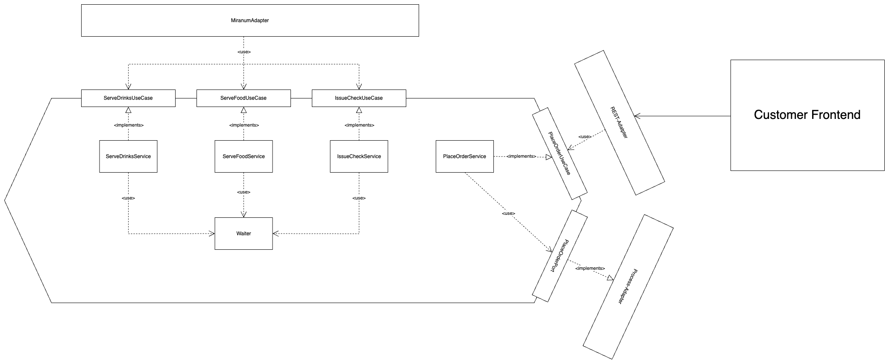

# Pizza order example

*This example demonstrates how to use miranum connect and how you can decouple microservices using it.*

There are four services in total:

* `waiter`: responsible for placing the order, serving beverages and issuing the check
* `kitchen`: responsible for the cooking
* `email`: responsible for notifying the customer for the order confirmation
* `frontend`: frontend to place order to the waiter service by REST

## Run the project

1. Start all services, namely the `WaiterC8Application`, `KitchenC8Application`, `EmailC8Application` and the `PizzaOrderFrontEnd`
2. Make sure that you have a running instance of the Camunda8 Engine running. <br> *If not, just start the camunda-8 stack under `stack/camunda-8`.*
3. Also make sure to deploy the `pizza-order-c8.bpmn` to the running Camunda8-Engine.
4. Now navigate to http://localhost:5050 to view the Frontend-Application. You will end up seeing something like this:

<br>
<div align="center">
    
</div>
<br>

Now you can start a new order by filling out the form. Provide food (one or a comma separated list), drinks
your name and your email address. The email is not actually sent. For the sake of this example it is just a print on the console of the email service.

*Info: When using any jetbrains related IDE you can start all four services by adding a compound run configuration.*

After submitting your order, you should notice the success message below.

<br>
<div align="center">
    
</div>
<br>

You now can follow the logs in the different service consoles to get a better overview on what is happening in the different services.

## The process


The order pizza example demonstrates a simple modern pizza order process.
The process starts with the order placement by the guest. This is a REST-call and for now 
After that the following steps will follow:

1. The `Notify guest` Task calls an independent email service which will handle the guest notification by mail 
*(This will just print to the email service console for now)* 
2. The `Waiter` will be called to serve the drinks
3. The `Prepare Pizza` process calls the kitchen service to make the pizza
4. If the cook in the kitchen takes too long to prepare the pizza gets bad and have to be disposed. As a result of that the order gets canceled
5. If the cook works fast, the kitchen service sends a message to the worker to come and serve the pizza to the guest
6. Finally, the waiter issues the check. The dinner was successful and the guest hopefully satisfied.

## Services and Architecture

The architecture we recommend to use for building integrations with miranum is the hexagonal architecture, also referred to as ports and adapters.
The goal of it is to decouple your domain from incoming and outgoing dependencies. Incoming dependencies are dependencies that
call our domain (e.g. REST-calls), outgoing dependencies get called by our domain (e.g. persistence layer).
An also common type of architecture to do so is the layer architecture. It usually looks something like this:

<br/>

<br/>

A problem with that - also discussed in "Get Your Hands Dirty On Clean Architecture" by Tom Hombergs - is that you still have
that outgoing dependency to your Data Access Layer which can lead to Database-Driven development instead of the Domain 
leading the development.
The suggested architecture that we also use to build the services looks roughly like this:

<br/>

<br/>

For more references see:

* [hexagonal architecture - there are always two sides to every story](https://medium.com/ssense-tech/hexagonal-architecture-there-are-always-two-sides-to-every-story-bc0780ed7d9c)
* [Alistair cockburn - hexagonal architecture](https://alistair.cockburn.us/hexagonal-architecture/)
* [Exploring hexagonal architecture by Jan Stenberg](https://www.infoq.com/news/2014/10/exploring-hexagonal-architecture/)

### Waiter

The waiter is responsible for placing the order, serving the food and the drinks and lastly issuing the check.

<br/>

<br/>

You notice the `MiranumAdapter` at the top of the diagram. This adapter is an incoming adapter, which is calling our service,
by using the use-cases defined by the service. This adapter basically calls the desired methods of the service using the
use-case interface provided by the services and wrapping this call in a `@Worker` annotated method.

```java
...

private final ServeDrinksUseCase serveDrinksUseCase;

@Worker(type = "serveDrinks")
public void serveDrinks(ServeDrinksCommand serveDrinksCommand) {
    serveDrinksUseCase.serveDrinks(serveDrinksCommand);
}
        
...
```

<br/>
This annotation is provided by miranum, and lets you register external tasks. The type of property maps to the task-definition type in the camunda modeler.<br/>
Notice that your service application does not have to know anything about the caller, here namely miranum.
The application can be implemented following DDD principles perfectly.
<br/>

Depending on which workflow engine you are willing to use miranum will handle all the communication in the background.
Currently, we support Camunda 7 and Camunda 8, but we are planning on integrating other engines in near future.

<br/>
