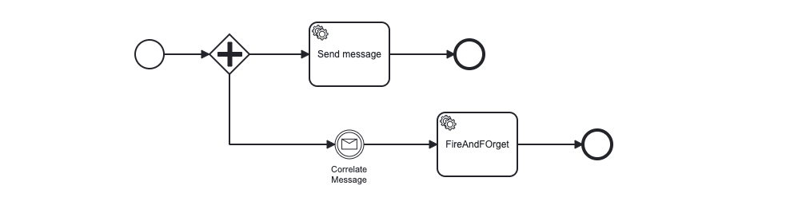

<div id="top"></div>

<!-- PROJECT SHIELDS -->

<!-- END OF PROJECT SHIELDS -->

<!-- PROJECT LOGO -->
<br />
<div align="center">
  <a href="#">
    
  </a>

<h3 align="center">Miranum</h3>

  <p align="center">
    <i>One connector to rule them all</i>
    <br /><a href="https://github.com/flowsquad/miranum/issues">Report Bug</a>
    ·
    <a href="https://github.com/flowsquad/miranum/issues">Request Feature</a>
  </p>
</div>

<!-- ABOUT THE PROJECT -->

## Simple Example

*This simple example project demonstrated the usage of miranum-core. Here we create a fairly simple process that is going to be automated using 
miranum-core. The project contains three modules:*
- [simple-example_camunda-7](simple-example-camunda-7)
- [simple-example_camunda-8](simple-example-camunda-8)
- [simple-example-core](simple-example-core)

*The application and domain logic is implemented in the `simple-example-core` project. It contains the services that get called from a workflow engine.*
*The process model is using the open standard bpmn.*
*The following image shows the process that is automated in the project:*

<div align="center">
   
</div>

<p align="right">(<a href="#top">back to top</a>)</p>

### Getting Started

1. Run this commands to start a `camunda-7` workflow engine running inside a docker container:
    ```shell
    cd ../../stack/camunda-7/
    docker-compose up -d
    ```
   
2. Start the application [ExampleC7Application.java](simple-example-camunda-7/src/main/java/io/miragon/miranum/integrations/example/c7/ExampleC7Application.java)
 
3. Open [message-c7.bpmn](simple-example-camunda-7/src/main/resources/bpmn/message-c7.bpmn) in the `Camunda modeler`.
 
4. Deploy diagram

Now you can simply start the process instance and view the log in the applications console.

<p align="right">(<a href="#top">back to top</a>)</p>
